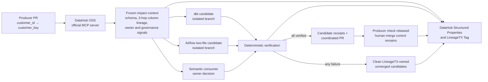

# LineageTX architecture

> **LineageTX — a schema-change safety gate across the data graph, inspired by two-phase commit.**

LineageTX treats a Producer schema change as a coordinated change across every
known downstream consumer. DataHub supplies the impact graph and governance
context; LineageTX prepares candidate repairs on isolated Git branches, verifies
them, pauses when business meaning is ambiguous, and releases the Producer PR
gate only after the bounded impact set is accounted for.

The two-phase-commit analogy is deliberately limited. LineageTX does **not**
implement a database transaction, promise atomicity across GitHub, DataHub, and
deployed systems, merge a pull request automatically, or roll back software that
has already been deployed.

## Bounded scenario

The reference scenario starts with one Producer ChangeIntent:

```text
ecommerce.raw.orders.customer_id -> customer_key
```

Real DataHub OSS contains one source plus a three-hop, column-level lineage path:

| Hop | DataHub asset | Participant | Decision |
| --- | --- | --- | --- |
| 1 | `analytics.stg_orders` | dbt SQL | Propose a one-file repair; accept only after SQLGlot and schema-variant checks pass. |
| 2 | `ops.customer_export` | Airflow mapping | Change the Python mapping and JSON configuration as one two-file candidate; both must pass together. |
| 3 | `semantic.customer_identity` | Semantic mapping | Refuse to guess the business meaning and perform zero writes until the exact DataHub owner approves the exact mapping. |

This scope is intentionally fixed at three consumers. Incomplete discovery,
missing ownership, an unexpected consumer, or a changed impact fingerprint is a
closed gate, not a best-effort migration.

## System flow



## 1. Change identity and discovery

A `ChangeIntent` binds the migration ID to the Producer repository and PR,
base and head SHAs, source asset URN, old and replacement fields, rollout phase,
and contract-schema fingerprint. Its SHA-256-derived identity prevents a later
request from silently reusing the same migration ID for a different change.

The DataHub reader connects to a full DataHub OSS GMS through the official
`mcp-server-datahub` process. It uses the official MCP tools to read:

- paginated schemas for the source and consumers;
- column lineage and paths through hops 1, 2, and 3+;
- asset entities, owners, tags, and Structured Properties; and
- sufficient path evidence to prove that each mapped participant is downstream
  of the changed source column.

The normalized context contains exactly four assets: the source and three
consumers. LineageTX hashes that context into an impact fingerprint, excluding
its own write-back fields. The fingerprint is checked again immediately before
the gate can be released.

The Lite compatibility bridge remains in the repository only for the preserved
legacy flow. It is not accepted as live LineageTX discovery evidence.

## 2. Prepare

`DETECTED -> PREPARING` opens one LineageTX-owned worktree and candidate branch
per participant at a pinned base SHA. The base checkout must be clean and remains
untouched.

The deterministic generator may return one of three closed candidate record
types. It receives no shell and cannot choose repositories, owners, paths,
schemas, or authority.
Those fields are rebound to the trusted `ChangeIntent`, DataHub snapshot, and
participant mapping before an adapter can write.

The adapters then decide whether a proposal is admissible:

- **dbt SQL:** one allow-listed file, one bounded `SELECT`, fixed relation,
  exact old-to-new substitution, SQLGlot AST checks, and compilation against
  both the expanded and contract schema variants.
- **Airflow mapping:** two exact allow-listed files, Python AST validation, JSON
  validation, deterministic mapping equivalence, cross-file consistency, and
  all-or-restore writes if either file operation fails.
- **Semantic mapping:** schema and occurrence checks are read-only before
  approval. The first prepare returns `NEEDS_APPROVAL` with zero changed files.
  Production reads one stable GitHub issue comment or approved PR review over
  HTTPS, maps its authenticated actor to the one discovered DataHub owner, and
  requires an exact migration/participant/old/new JSON body. Plain caller
  fields are accepted only by the explicitly labeled fixture test mode.

A participant becomes `VERIFIED` only after its exact allow-list is validated
and committed on its unmerged candidate branch. Candidate commit SHAs and
verification evidence are recorded in the state store.

## 3. State machine

The coordinator state machine is:

```text
DETECTED -> PREPARING -> NEEDS_APPROVAL -> PREPARED -> COMMITTED
    |           |               |              |
    +-----------+---------------+--------------+-> ABORTED
```

`PREPARING -> PREPARED` is also legal when no approval is required, although the
reference three-consumer scenario intentionally exercises `NEEDS_APPROVAL`.
`COMMITTED` and `ABORTED` are terminal.

Participant state is tracked separately:

```text
DISCOVERED -> PREPARING -> VERIFIED -> COMMITTED
                   |          |
                   |          +-> ABORTED
                   +-> NEEDS_APPROVAL -> PREPARING
                   +-> FAILED -> PREPARING
```

SQLite transitions use expected state and version checks, and every transition
appends an event. The store refuses `PREPARED` unless every participant is
verified with a candidate commit SHA. It refuses `COMMITTED` unless candidate,
coordinated-PR, and Producer-gate receipts cover the migration.

## 4. Commit and gate semantics

Before commit, LineageTX re-reads DataHub through the official MCP path. A
different impact fingerprint aborts publication and leaves the Producer gate
closed. If the context is unchanged, the publisher records all three candidate
commits, creates or represents one coordinated PR, and posts or represents the
Producer check result.

In LineageTX, `COMMITTED` means:

- all three candidate commits exist and remain unmerged;
- a coordinated PR receipt exists;
- a Producer gate-release receipt exists; and
- the final state records zero unverified consumers.

It does **not** mean that any PR was merged or any code was deployed. The GitHub
publisher intentionally exposes PR creation and commit-status operations but no
merge operation. The local publisher produces the same receipt shape without
performing network writes.

## 5. DataHub write-back

LineageTX writes the migration result back to the exact frozen four-asset set.
Structured Properties carry:

- migration ID;
- current coordinator or participant status;
- accountable DataHub owner; and
- an HTTPS evidence link.

The `LineageTXMigration` Tag marks participating assets. Mutations are followed
by official-MCP read-back and a SHA-256 receipt. The write journal makes partial
failure explicit and supports idempotent retry. A final `COMMITTED` write-back
requires a newly refreshed, unchanged impact context.

## 6. Abort semantics

`ABORTED` means LineageTX audited and attempted to remove only worktrees and
branches it owns. It refuses to delete a candidate that is already reachable
from another branch. The cleanup receipt records removed worktrees, deleted
branches, and any cleanup errors.

ABORT does not revert a merge, undo a deployment, change a database, or claim
that an external side effect was rolled back. If DataHub write-back fails after
local cleanup, the local `ABORTED` result remains and the idempotent write-back
must be retried.

## 7. Replay and live modes

- **Local deterministic replay:** runs the real coordinator, adapters, Git
  worktrees, state machine, validations, receipts, and evidence writer against
  controlled fixture repositories. DataHub context is a disclosed replay
  fixture, not a live catalog claim.
- **Public interactive synthetic replay:** lets a viewer trigger the same bounded
  state story in a browser. The replay fixture and preserved legacy baseline
  have canonical SHA-256 manifests, but the browser is not connected to DataHub
  or GitHub and does not prove the live workflow ran.
- **Live evidence run:** uses real DataHub OSS Quickstart, official MCP discovery
  and read-back, isolated local Git repositories, and DataHub write-back. The
  public bundles and recorded rerun video evidence this mode. The public replay
  remains explicitly separate and does not imply that it is a live control plane.

See [security-model.md](security-model.md) for trust boundaries and
[demo-script.md](demo-script.md) for the recorded demonstration.
